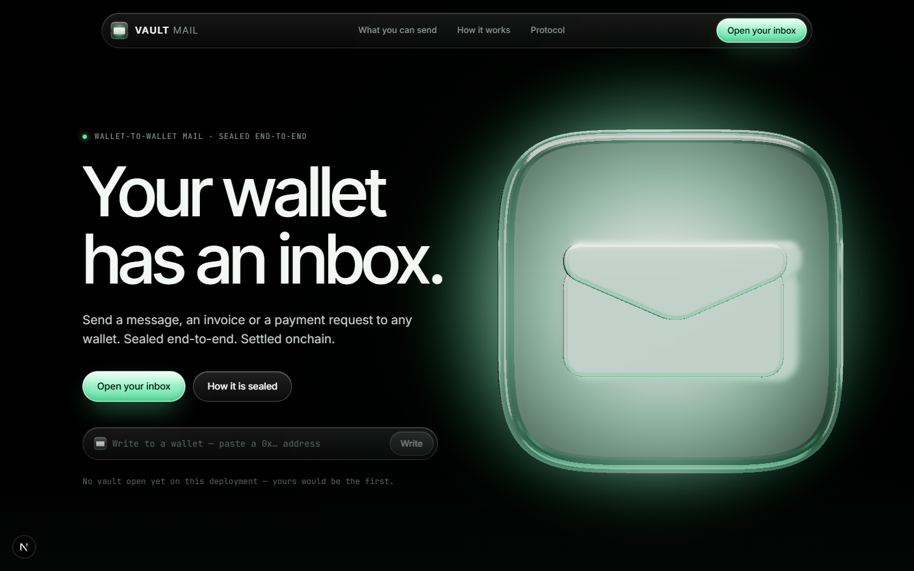
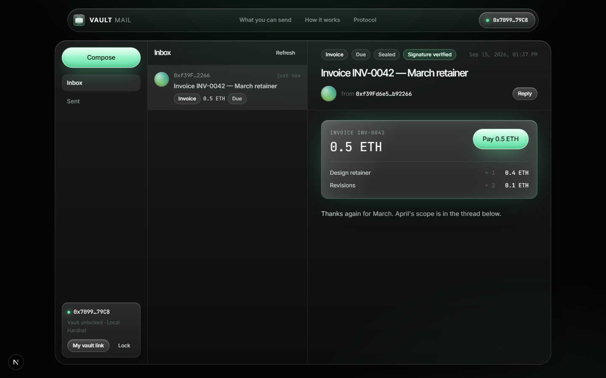
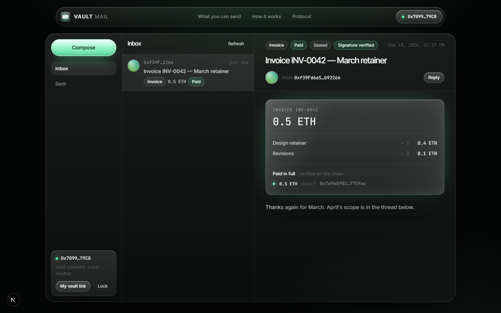
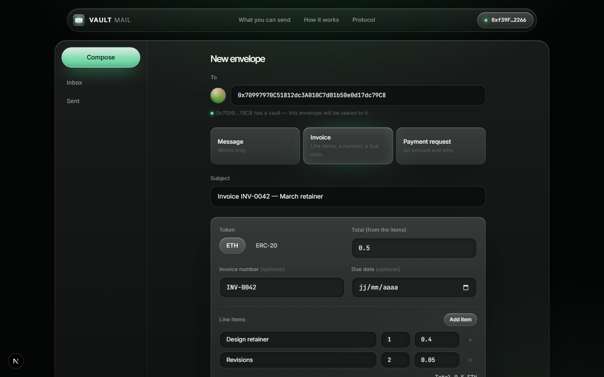
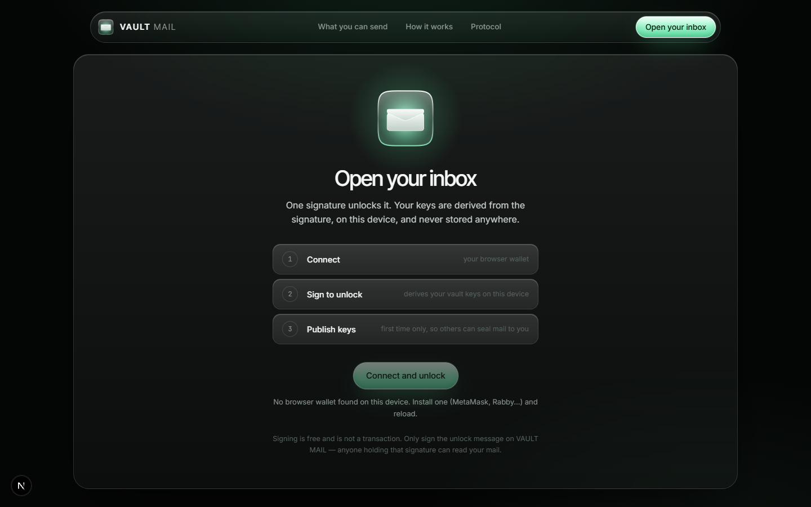

# VAULT MAIL — Your wallet has an inbox.

Wallet-to-wallet mail. Any wallet can put three things in another wallet's inbox: a **message**, an **invoice**, a **payment request**. Envelopes are sealed end-to-end with keys derived from the wallet's own signature; invoices and requests are paid *from the envelope* with an ordinary transfer on Robinhood Chain, and the receipt — read back from the chain — is pinned to the envelope for both sides.

No account, no email, no password. No contract of ours between payer and payee, no fee, nothing held.



## Screens

| | |
| --- | --- |
|  |  |
|  |  |

- `/` — the landing: the glass envelope (three.js, real refraction over a backlight, no assets), what you can send, how it works, what is sealed and what is not, FAQ.
- `/inbox` — the mail client: unlock with a signature, inbox / sent, reading pane, **Pay** on invoices and requests, receipts with explorer links.
- `/compose` — message, invoice (line items, number, due date, ETH or any ERC-20) or payment request; the recipient's vault decides sealed vs unsealed, and the button says which.
- `/to/0x…` — a wallet's public door: share it, anyone can write to you, bill you or ask you.
- `/protocol` — the design, in the order it happens.
- `/api/health` — chain, storage, and whether the storage survives a restart.

## How it works (short version — the long one is `/protocol`)

1. **Keys from a signature.** The wallet signs a fixed text (`personal_sign`). Wallets sign deterministically, so the signature is hashed into a seed and expanded (HKDF) into an x25519 *seal* key and an ed25519 *sign* key — on the device, never stored, never sent. Closing the tab locks the vault.
2. **The registry.** The first time, the wallet also signs a registration naming its public keys. `GET /api/keys/0x…` serves it to anyone; a client verifies it with nothing but the address. The server cannot forge or swap a key.
3. **Envelopes.** Header in the clear (`from`, `to`, `id`, `createdAt`), payload encrypted with XChaCha20-Poly1305 under a fresh content key, that key wrapped (x25519 + HKDF) once for the recipient and once for the sender, the AEAD bound to the header, the whole thing signed with the sender's ed25519 key. The server verifies the signature against the registry before storing; the reader verifies it again.
4. **Requests without sessions.** Every read/write is signed with the vault's sign key (`x-vault-*` headers). No cookies, no server secret, nothing to leak between instances.
5. **Receipts.** The payer transfers straight to the payee, hands the hash to `POST /api/messages/:id/receipts`, and the server reads the transaction from its own RPC: success, sent by the envelope's recipient, value (native or ERC-20 `Transfer`) to the envelope's sender, one transaction per envelope. The requested amount is sealed, so the server records what was paid; each side's client shows *paid in full / partly paid / due*.

**What the server sees:** who wrote to whom, when, whether it is sealed, and receipts (public onchain anyway). **What it cannot see:** subject, body, kind, amount, token, due date, line items, invoice number, reply references.

**If the recipient has no vault:** there is no key to seal to. The sender is told and may send *unsealed* (stored in plain JSON, labelled on both sides). The server refuses an unsealed envelope to a wallet that has a vault, so nothing is quietly downgraded.

## Run

```bash
npm install
npm run dev          # http://localhost:3990
```

Any injected wallet (MetaMask, Rabby, Coinbase extension…). The chain is Robinhood Chain (id 4663) unless `NEXT_PUBLIC_VAULT_CHAIN_ID=31337` for a local Hardhat node.

## Test

```bash
npm test                    # 7 protocol tests: derivation, seal/open both ways, tamper detection, request auth
npm run e2e                 # 43 checks against a local Hardhat node + a server on :3991 (see below)
node scripts/ui-e2e.mjs     # 12 checks: headless Chrome + a stub EIP-1193 wallet drives the real screens
node scripts/capture.mjs    # screenshots of the site → docs/captures/
```

The end-to-end scripts need the local chain package once:

```bash
cd chain && npm install && npm run compile && cd ..
```

They start `npx hardhat node` and a `next dev` on port 3991 with a temporary database, then: two wallets open vaults, unsealed and sealed mail, every refusal (forged registration, unsealed to a vaulted wallet, re-dated envelope, spoofed sender, wrong sign key, foreign envelope by id), a 0.5 ETH invoice paid and verified, a 25 mUSD (mock ERC-20) request paid and verified, and the receipts that must be refused (wrong recipient, wrong payer, reused transaction, unknown hash). The UI script does it through the actual pages — door, compose, Pay button, receipts — and writes `docs/captures/ui-*.png`. Stop `next dev` on this folder first: two dev servers share `.next/dev`.

Last run: **7 / 7**, **43 / 43**, **12 / 12**.

## Configuration

See [.env.example](.env.example). Everything has a default.

| Variable | What |
| --- | --- |
| `NEXT_PUBLIC_SITE_URL` | Canonical URL for metadata. |
| `NEXT_PUBLIC_VAULT_CHAIN_ID` | 4663 (Robinhood Chain, default) or 31337 (local Hardhat). Inlined at build time. |
| `NEXT_PUBLIC_VAULT_RPC_URL`, `NEXT_PUBLIC_VAULT_EXPLORER_URL` | Overrides for the browser. |
| `VAULT_CHAIN_ID`, `VAULT_RPC_URL` | The server's own chain and RPC for verifying receipts, read at runtime. |
| `VAULTMAIL_DB_PATH` | Where the SQLite file lives. Default `./data/vaultmail.db`. |

## Deploy

One Next.js app at the repository root: import the repo in Vercel and it builds as-is (Node ≥ 22.13 for `node:sqlite`; `engines` says so). Two things to know:

- **Storage.** On a read-only host (Vercel) the database falls back to the OS temp directory — it works, `/api/health` reports `ephemeral: true`, and every cold start is an empty registry and empty inboxes, not shared between instances. Fine to show the product. To keep anyone's mail, run it where `VAULTMAIL_DB_PATH` can point at a disk, or move `src/lib/server/store.ts` to a hosted database (the store is ~150 lines of plain SQL).
- **RPC.** Receipts are verified through `VAULT_RPC_URL` (defaults to Robinhood Chain's public RPC). Set your own for anything busy.

## What is proven and what is not

Proven: the protocol (unit tests), the whole API against a real local chain (`e2e`), and the real screens driven in a real browser with a stub wallet that signs and sends for real (`ui-e2e`), including an actual 0.5 ETH transfer landing in the payee's balance.

Not proven: a real wallet extension in a real browser (none is available in the environment this was built in — the stub implements the same EIP-1193 calls MetaMask answers), and anything on Robinhood Chain itself: nothing needs deploying, but no receipt has been verified against the public RPC yet.

Honest limits, also on the site: the server sees who writes to whom and when; the unlock signature *is* the secret (never sign it elsewhere); wallets that do not sign deterministically get a different vault per day, and the client says so instead of silently republishing.

## Open decisions

- Name and domain (`vaultmail` is a working name; nothing registered), WalletConnect (injected wallets only for now), a hosted database for a public deployment, ENS-style names on Robinhood Chain (none exist; addresses only), and whether receipts should also be tagged onchain (an `invoiceId` in calldata or a tiny receipts contract) so a third party can link a payment to an envelope without the server.

## Layout

```
src/lib/protocol/   keys, envelopes, request auth — pure functions, shared by browser, server and tests
src/lib/server/     SQLite store (node:sqlite), receipt verification (viem), HTTP helpers
src/app/api/        keys, messages, receipts, stats, health
src/components/     three.js hero, glass UI, vault provider, inbox, compose
src/lib/three/      the studio painted at runtime (PMREM env), the backlight
chain/              Hardhat + a mock ERC-20, only for the end-to-end tests
scripts/            e2e.ts, ui-e2e.mjs, capture.mjs, build-mark.ts
```
